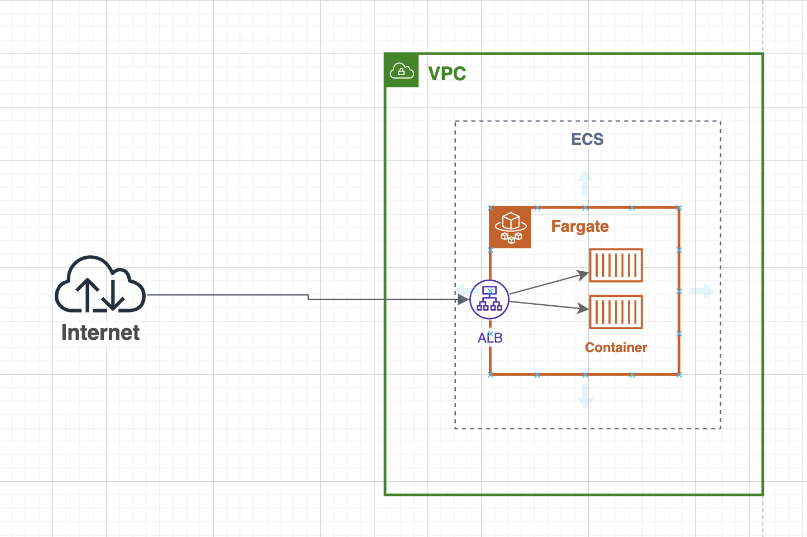

## Demo: Nodejs expressjs openapi

### Tech stack
- AWS ECR
- AWS ECS
- Docker
- Swagger
- NodeJS

### What do i do?
In this project, i want to try the bellow action
- API Definition: [Swagger](https://swagger.io/)
using `swagger` for definition API (very simple) and use it in project
- Create a Dockerfile to build a docker image
- Push it into [AWS ECR](https://aws.amazon.com/ecr/)
- Run it on [AWS ECS](https://aws.amazon.com/ecs/)

### Architecture
At first, i do the above things by manual then All infra and cicd setting will be implemented as code.  
 (will be created in another repo)

